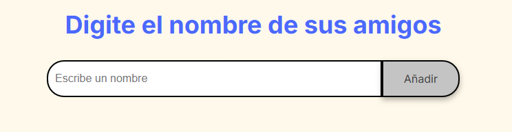
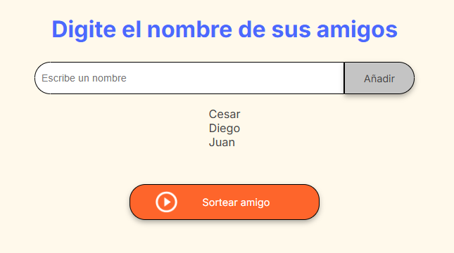
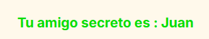

<a id="readme-top"></a>


<!-- PROJECT LOGO -->
<br />
<div align="center">
  <a href="https://github.com/SumRug/Amigo-Secreto">
    
  </a>

<h3 align="center">🎁 Amigo Secreto</h3>
<p align="center">
  Aplicación en JavaScript para organizar sorteos de amigo secreto de forma sencilla y divertida.
    <br />
  <br />
    <a href="https://sumrug.github.io/Amigo-Secreto/"><strong>🌐 Ver página en vivo</strong></a>
    <br /><br />
    &middot;
    <a href="https://github.com/SumRug/Amigo-Secreto/issues/new?labels=bug&template=bug-report---.md">Reportar un bug</a>
    &middot;
    <a href="https://github.com/SumRug/Amigo-Secreto/issues/new?labels=enhancement&template=feature-request---.md">Sugerir una mejora</a>
  </p>
</div>


<!-- TABLE OF CONTENTS -->
<details>
  <summary>Tabla de contenidos</summary>
  <ol>
    <li>
      <a href="#Acerca-del-proyecto">Acerca del proyecto</a>
      <ul>
        <li><a href="#Construido-con">Construido con</a></li>
      </ul>
    </li>
    <li>
      <a href="#Empezando">Empezando</a>
      <ul>
        <li><a href="#Instalacion">Instalación</a></li>
      </ul>
    </li>
    <li><a href="#Uso">Uso</a></li>
    <li><a href="#Contacto">Contacto</a></li>
  </ol>
</details>


<!-- ABOUT THE PROJECT -->
## Acerca del proyecto

**Amigo Secreto** es una aplicación ligera y rápida desarrollada en **JavaScript**, que permite realizar sorteos de amigo secreto de manera justa y aleatoria.  
Es ideal para eventos familiares, reuniones de trabajo o celebraciones con amigos.

**Características principales:**
- Agregar participantes de forma ilimitada.
- Sortear automáticamente evitando repeticiones.
- Interfaz sencilla y fácil de usar.
<p align="right">(<a href="#readme-top">back to top</a>)</p>


### Construido con

* [![JavaScript][JS]][JS-url]
* [![HTML5][HTML]][HTML-url]
* [![CSS3][CSS]][CSS-url]

<p align="right">(<a href="#readme-top">back to top</a>)</p>


<!-- GETTING STARTED -->
## Empezando


### Instalacion

Sigue estos pasos para usar el proyecto en tu máquina local:

1. Clona el repositorio:
   ```bash
   git clone https://github.com/SumRug/Amigo-Secreto.git
Abre el archivo index.html en tu navegador.

¡Listo! Ya puedes comenzar a agregar nombres y sortear.


<p align="right">(<a href="#readme-top">back to top</a>)</p>


<!-- USAGE EXAMPLES -->
## 💻 Uso
<a href="https://sumrug.github.io/Amigo-Secreto/"><strong>🌐 Ver página en vivo</strong></a>

1. **Ingresa el nombre de un participante en el campo de texto**

 
   
   

3. **Pulsa _Agregar_ para sumarlo a la lista**

   

5. **Cuando todos estén añadidos, presiona _Sortear_**  


6. **El sistema asignará un amigo secreto de forma aleatoria**  
   *(Ejemplo de resultado final)*  
   


<p align="right">(<a href="#readme-top">back to top</a>)</p>


<!-- CONTACT -->
## Contacto

Cesar Delgado - sumrug98@gmail.com

Project Link: [https://github.com/SumRug/Amigo-Secreto](https://github.com/SumRug/Amigo-Secreto)

<p align="right">(<a href="#readme-top">back to top</a>)</p>


<!-- MARKDOWN LINKS & IMAGES -->
<!-- https://www.markdownguide.org/basic-syntax/#reference-style-links -->
[JS]: https://img.shields.io/badge/JavaScript-F7DF1E?style=for-the-badge&logo=javascript&logoColor=black
[JS-url]: https://developer.mozilla.org/es/docs/Web/JavaScript
[HTML]: https://img.shields.io/badge/HTML5-E34F26?style=for-the-badge&logo=html5&logoColor=white
[HTML-url]: https://developer.mozilla.org/es/docs/Web/HTML
[CSS]: https://img.shields.io/badge/CSS3-1572B6?style=for-the-badge&logo=css3&logoColor=white
[CSS-url]: https://developer.mozilla.org/es/docs/Web/CSS
[Bootstrap.com]: https://img.shields.io/badge/Bootstrap-563D7C?style=for-the-badge&logo=bootstrap&logoColor=white
[Bootstrap-url]: https://getbootstrap.com
[JQuery.com]: https://img.shields.io/badge/jQuery-0769AD?style=for-the-badge&logo=jquery&logoColor=white
[JQuery-url]: https://jquery.com 
